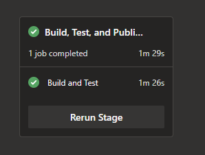
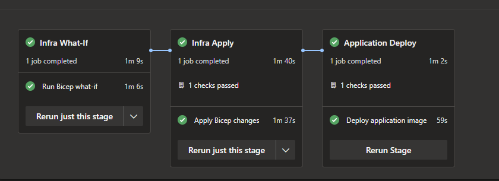

# DevOps Take-Home Solution

## 1. Application Bug: Root Cause and Fix

The `/count` endpoint returned an unexpected value (`0`) on first call due to post-increment semantics in the original implementation.

### Root cause

Original behavior in the counter service:

```csharp
return _counter++;
```

This is a post-increment expression, which returns the current value first and increments afterward.

Execution flow on first request:

1. `_counter` starts at `0`
2. `return _counter++` returns `0`
3. `_counter` is then updated to `1`

That produced an off-by-one result from the API consumer perspective: first call returned `0` instead of the expected `1`.

### Fix

Implemented in `src/Services/CounterService.cs`:

```csharp
_counter++;
return _counter;
```

I chose the explicit two-line form for readability, so the mutation and returned value are clearly separated.

### Test coverage improvements

Pre-existing tests were refactored to validate real state transitions in the concrete `CounterService`.

- Previous mock-based tests were not ideal for this case, because mocks can validate configured outputs without exercising actual increment semantics.
- Current tests in `tests/CounterAPI.Tests/CountControllerTests.cs` verify:
  - first call returns `1`
  - sequential calls return `1`, `2`, `3`

These tests act as direct regression coverage for the original post-increment bug.

## 2. Live Service

- Base URL: https://docosoft-counterapi-we.azurewebsites.net/
- Health: https://docosoft-counterapi-we.azurewebsites.net/Health
- Count endpoint: https://docosoft-counterapi-we.azurewebsites.net/count

## 3. Infrastructure (Bicep) Design

Infrastructure is implemented in Bicep under `iac/` and is now deployed at **resource-group scope**.

### Core resources provisioned

- Azure Container Registry (`iac/modules/acr.bicep`)
- Linux App Service Plan + Linux App Service (`iac/modules/appservice.bicep`)
- User-assigned managed identity for App Service image pull
- Application Insights
- Log Analytics Workspace
- Diagnostic settings for Web App + ACR
- Action Group + baseline alerts (5xx and latency)
- Pipeline user-assigned managed identity and RBAC (`iac/modules/pipeline-identity.bicep`)

### Security and access decisions

- ACR admin user is disabled.
- App Service pulls from ACR using managed identity (`AcrPull`) rather than registry credentials.
- Pipeline identity is created via IaC and granted:
  - `Contributor` on resource group
  - `User Access Administrator` on resource group (needed for RBAC resources in deployment)
  - `AcrPush` on ACR

### Tagging

Common tags are applied to supported resources:

- `environment: production`
- `owner: smouchlianitis`
- `project: docosoft`

## 4. CI/CD Pipelines

Two Azure DevOps YAML pipelines are included:

Application runtime additions supporting operations and observability:

- Added `/Health` endpoint support for App Service health checks and CD health validation.
- Added OpenTelemetry integration with Azure Monitor export for application telemetry.

- `azure-build.yml` (CI)
  - Triggered on `main`
  - Restores and tests the .NET solution
  - Builds Docker image
  - Pushes image tags:
    - immutable build tag: `counterapi:<Build.BuildId>`
    - rolling tag: `counterapi:latest`

- `azure-release.yml` (CD)
  - Triggered from CI pipeline completion
  - Infra flow split into:
    - `what-if`
    - approval checkpoint
    - apply
  - App flow updates only the container image tag (infra does not own runtime image tag)
  - Health check validates `/Health`
  - Rollback step restores previous image if health check fails

### Pipeline Execution Evidence

#### CI pipeline (`azure-build.yml`)



This run shows restore, test, Docker build, and image push steps completing successfully.

#### CD pipeline (`azure-release.yml`)



This run shows the deployment flow across infrastructure and application stages.

## 5. Trade-offs and Assumptions

### Trade-offs

- ACR public network access is currently enabled to keep delivery flow simple without introducing VNet/private endpoint complexity in this iteration.
- Alerts are intentionally baseline-level and can be tuned further once production telemetry patterns stabilize.
- Deployment slots are not used, to avoid increasing scope and complexity for this exercise.
- The first implementation used subscription-scope deployment to create the resource group automatically. In practice, that required giving the pipeline identity overly broad subscription-level rights, which is not aligned with least privilege. I switched to resource-group scope so CI/CD runs with narrowly scoped access on the target resource group.

### Assumptions

- A single production resource group is used for this exercise.
- The target resource group already exists before CD runs (the pipeline deploys at resource-group scope and does not create the resource group).
- Azure DevOps service connection is configured with workload identity federation to the pipeline managed identity.
- Required Azure DevOps `production` environment checks/approvals are configured in Azure DevOps UI (outside repository YAML).
- The Action Group notification receiver email is valid and confirmed so alerts can be delivered.

## 6. Additional Enhancements

Beyond the minimum requirements, I added the following operational and reliability improvements:

### Operational readiness

- Added a dedicated `/Health` endpoint in `src/Controllers/HealthController.cs`.
- Configured App Service health checks to use `/Health` in `iac/modules/appservice.bicep`.
- Added a post-deploy health validation step in `azure-release.yml`.
- Implemented automated rollback to the previously running container image if health validation fails.

### Observability

- Added OpenTelemetry instrumentation with Azure Monitor export in `src/Program.cs`.
- Provisioned a Log Analytics Workspace in `iac/modules/observability.bicep`.
- Enabled diagnostic settings for both Web App and ACR into Log Analytics.

### Alerting and incident response baseline

- Provisioned an Action Group for notification routing.
- Added baseline metric alerts for:
  - elevated HTTP 5xx responses
  - elevated average response time

### Identity and access hardening

- Disabled ACR admin user access in `iac/modules/acr.bicep`.
- Configured App Service to pull container images from ACR via managed identity (`AcrPull`) instead of registry credentials.
- Provisioned a pipeline managed identity with scoped RBAC to support deployment automation.

## 7. Future Improvements

- Add deployment slots (`staging` -> `production`) to enable safer blue/green-style rollouts and near-instant rollbacks.
- Move ACR to private access (private endpoint + private DNS + VNet integration for App Service and pipeline agents).
- Separate pipeline identities and service connections for CI and CD to tighten least-privilege boundaries.
- Extend alerting with service-level objectives and actionable thresholds based on real production baseline data.
